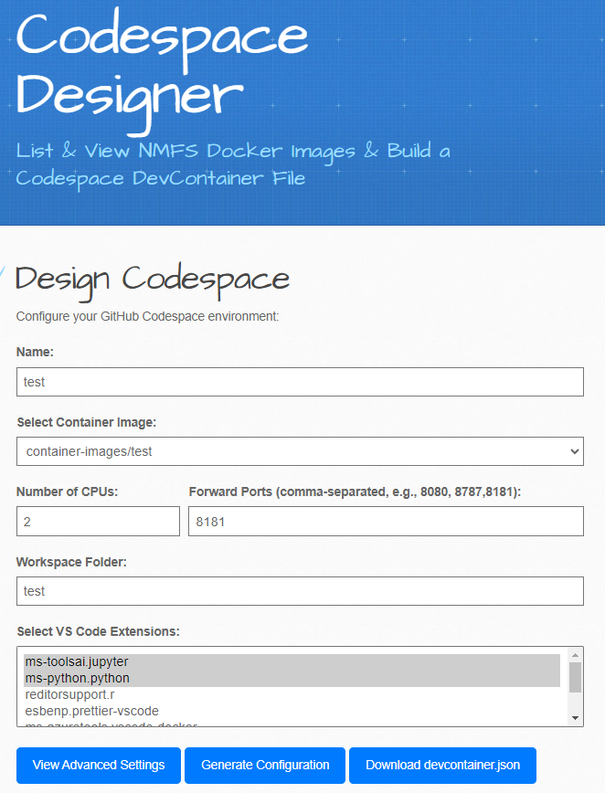
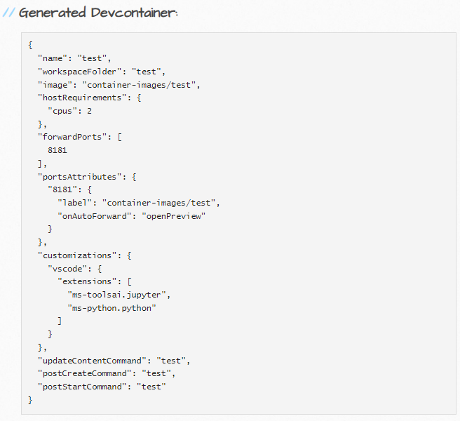

# Codespace Designer
  <a href="https://michaelakridge-noaa.github.io/codespace-designer/" align="right">
    
  </a>

- Use to configure a GitHub Codespace environment
- Powered by Github Pages to help design a codespace devcontainer file
  - Link: https://michaelakridge-noaa.github.io/codespace-designer/


## Design a Codespace 
[](https://michaelakridge-noaa.github.io/codespace-designer/)

[](https://michaelakridge-noaa.github.io/codespace-designer/)

## Install Codespace File
- add to repo in a folder called ".devcontainer" e.g.:
```
.devcontainer/devcontainer.json
```
## Use Pre-Configured Codespaces 
- #### https://github.com/MichaelAkridge-NOAA/Open-Science-Codespaces

## Learn More About Developing a Codespace
- https://docs.github.com/en/codespaces/getting-started/deep-dive
- https://docs.github.com/en/codespaces/developing-in-a-codespace/developing-in-a-codespace

## Sources / More Info
- Codespace Generator: Generates the package.json for each Docker container listed in a GitHub organization's package registry.
  - https://github.com/MichaelAkridge-NOAA/codespace-generator
- Image list: This example uses the NMFS-OPENSCIs GitHub organizations package registry. 
  - https://github.com/nmfs-opensci/container-images
----------
### Disclaimer
This repository is a scientific product and is not official communication of the National Oceanic and Atmospheric Administration, or the United States Department of Commerce. All NOAA GitHub project content is provided on an ‘as is’ basis and the user assumes responsibility for its use. Any claims against the Department of Commerce or Department of Commerce bureaus stemming from the use of this GitHub project will be governed by all applicable Federal law. Any reference to specific commercial products, processes, or services by service mark, trademark, manufacturer, or otherwise, does not constitute or imply their endorsement, recommendation or favoring by the Department of Commerce. The Department of Commerce seal and logo, or the seal and logo of a DOC bureau, shall not be used in any manner to imply endorsement of any commercial product or activity by DOC or the United States Government.

#### License
See the [LICENSE.md](./LICENSE.md) for details
